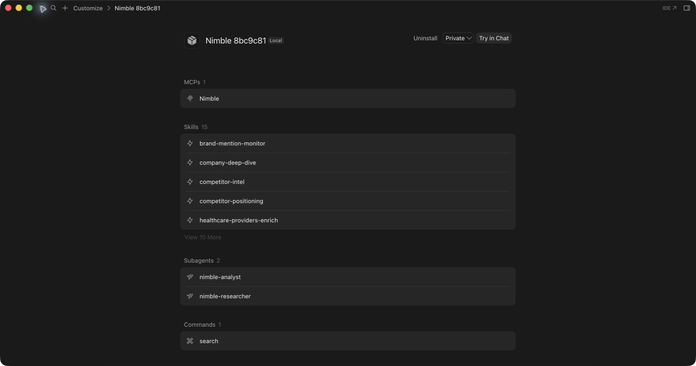
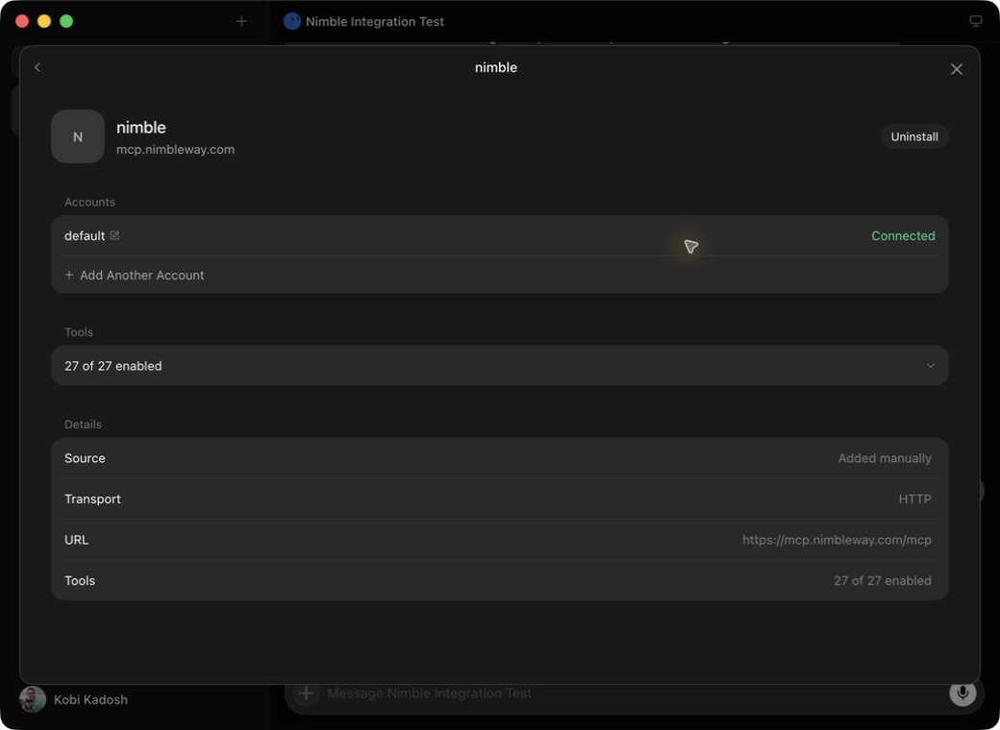
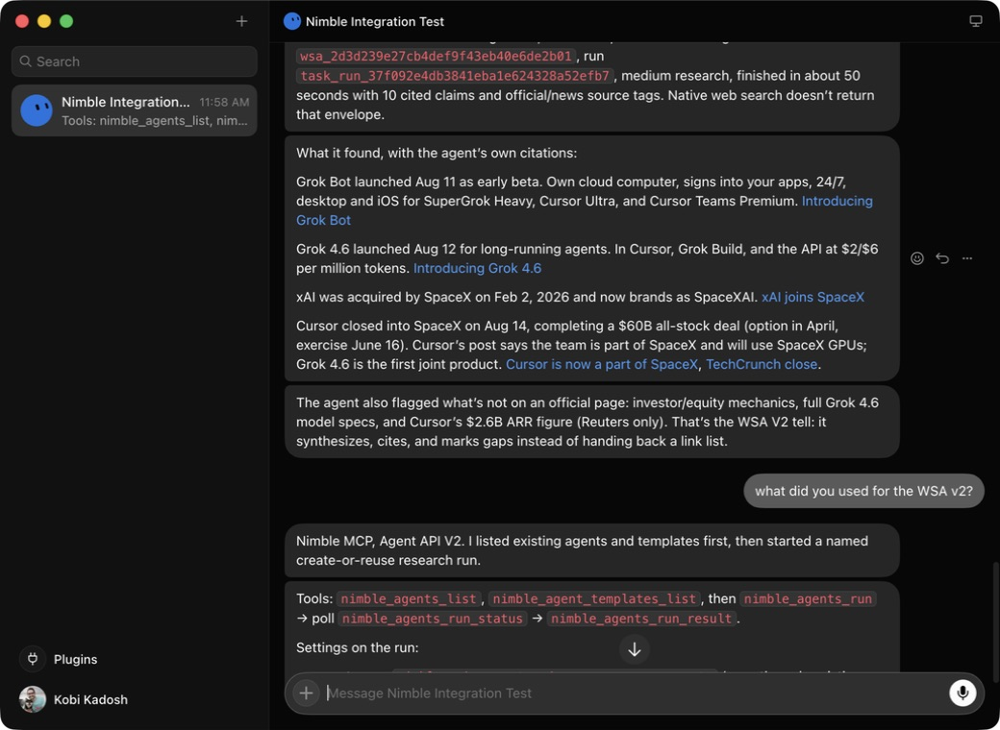
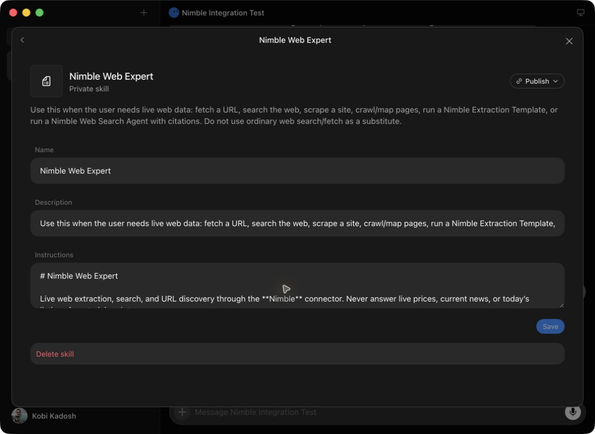

# INNOV-587 exact-commit integration evidence

Evidence captured on 2026-08-19 from commit
`8bc9c811f82a3096d07c211ea0543c73203fea01` on PR #67.

## Cursor IDE



The detached checkout at
`~/.cursor/plugins/local/nimble-8bc9c81` resolved to the commit above. Cursor's
native plugin view discovered the package as `Nimble 8bc9c81` and showed one
MCP server, 15 skills, two subagents, and one command. Cursor plugin-host logs
recorded `loadUserLocalPlugin nimble-8bc9c81` with zero aggregate plugin-load
failures; the redacted excerpt is included in `cursor-plugin-load.log`.

This is a local private installation. Cursor Marketplace submission, review,
listing, acceptance, and publication were not performed and remain separate
open gates.

Reproduce the credential-free packaging checks:

```bash
python3 scripts/check-plugin-manifests.py
bash scripts/check-plugin-structure.sh
bash scripts/tag-release.sh --check
```

Observed results: 162 manifest checks passed, plugin structure passed, and all
22 version references agreed on `1.6.1`.

## Grok Bot hosted MCP



Grok Bot showed a manually added HTTP connector named `nimble`, connected to
`https://mcp.nimbleway.com/mcp`, with 27 of 27 tools enabled. An unauthenticated
credential-free MCP initialization probe returned `401 Unauthorized` and the
server's OAuth protected-resource metadata, as expected. No credential appears
in the screenshots or repository.

The connected account shown in the app had already been authorized by the
account owner. The unauthenticated `401` probe was a separate out-of-band
reachability check and did not establish or modify that authenticated account.

## Grok Bot Web Search Agent / Agent API V2 lifecycle



The account owner initiated this live run in Grok Bot. The Bot reported this
tool sequence through the Nimble MCP:

1. `nimble_agents_list`
2. `nimble_agent_templates_list`
3. `nimble_agents_run`
4. poll `nimble_agents_run_status`
5. `nimble_agents_run_result`

The UI preserved agent ID
`wsa_2d3d239e27cb4def9f43eb40e6de2b01` and run ID
`task_run_37f092e4db3841eba1e624328a52efb7` across queued, running, and finished
messages. The terminal response reported ten cited claims, labeled
official/news sources, stable Nimble attribution, and explicit gaps where an
official source did not support a claim.

## Grok skill provenance and remaining gate



This is intentionally not claimed as exact-commit canonical-plugin discovery.
Grok Bot displayed three locally created private Nimble skills. The inspected
`Nimble Web Expert` instructions were a local adaptation and not an installed
copy proven to match this repository commit. Placing the exact checkout under
the documented Grok Build user-plugin directory (`~/.grok/plugins/`) did not
make a separate canonical plugin appear in the Grok Bot app's `Yours` view.

Therefore the evidence proves the hosted MCP and Agent API V2 lifecycle in
Grok Bot, but the exact-commit canonical skill/plugin installation gate remains
open. Marketplace submission, acceptance, publication, and activation remain
separate and were not performed.

We did not trigger a failing run to capture its structured error format because
that would require another live, potentially billable Nimble operation. Secret
safety is evidenced only by the absence of credentials from manifests, the
redacted Cursor log excerpt, and screenshots; it is not a claim that every
external runtime log was audited.

## xAI plugin-marketplace catalog entry — validated candidate, not submitted

[`xai-catalog-entry.json`](xai-catalog-entry.json) is the candidate entry for
`.grok-plugin/marketplace.json` in
[xai-org/plugin-marketplace](https://github.com/xai-org/plugin-marketplace),
pinning this repository at implementation commit
`8bc9c811f82a3096d07c211ea0543c73203fea01`. It follows that catalog's
remote-source contract and the brand-scoped keyword/domain rule from its
CONTRIBUTING.md, matching the style of the existing `exa`, `tavily`, and
`firecrawl` entries. The `description` is byte-identical to the shared
description in this repository's plugin manifests.

Validated on 2026-08-19 in a local clone of xai-org/plugin-marketplace at its
then-HEAD `e5c73400a2ec55fa0abd1efbc8908a5aa801dcce`, with the entry appended
to `.grok-plugin/marketplace.json`:

```bash
python3 scripts/validate-catalog.py          # Catalog OK (.grok-plugin/marketplace.json)
python3 scripts/generate-plugin-index.py     # Wrote .grok-plugin/plugin-index.json
python3 scripts/generate-plugin-index.py --check  # Plugin index OK
```

The official index generator fetched this repository at the pinned SHA and
recorded: version `1.6.1`, 15 skills, 2 agents, 1 command, 1 MCP server. No
upstream packaging change to this repository was required — the tree indexes
as-is.

Not performed, by instruction: no fork was pushed, no PR was opened against
xai-org/plugin-marketplace, and nothing was submitted to xAI or Cursor.
Remaining vendor gates: (a) open the xAI catalog PR with this entry, pinning the
approved canonical upstream revision, and pass xAI CI plus code-owner review;
(b) Cursor Marketplace submission via cursor.com/marketplace/publish and
Cursor-team review; (c) whether xAI catalog acceptance propagates to the Grok
Bot app's plugin picker (beyond Grok Build) is not established by official
documentation and remains to be observed after acceptance.

## Grok Bot app marketplace observation under active entitlement (2026-08-19)

With the Cursor/xAI Bot trial active for the operator account and Grok Bot
onboarding completed (dedicated "Nimble Demo" bot created), the operator
session observed in the Grok Bot app:

- **Plugins → Marketplace**: searching "Nimble" returned no Nimble entry; the
  only result was Revyl.
- **Plugins → Yours**: "No installed plugins match \"Nimble\"" and "No private
  skills match \"Nimble\"".
- Bot settings and global settings exposed no private, local, or developer
  plugin-import control; the File menu offered only Close Window / Close All.

Cross-check against primary sources the same day:

- `revyl` does not appear in xai-org/plugin-marketplace's
  `.grok-plugin/marketplace.json` at catalog HEAD
  `e5c73400a2ec55fa0abd1efbc8908a5aa801dcce`. The Bot app's marketplace is
  therefore not (or not only) the public Grok Build catalog — at least one Bot
  marketplace entry has no public catalog counterpart.
- xai-org/plugin-marketplace's README and CONTRIBUTING describe the catalog as
  what "points Grok Build at your plugin's source"; they never mention the Bot
  app. Configurable marketplace sources (`[[marketplace.sources]]` in
  `~/.grok/config.toml`, `known_marketplaces.json`) and local plugin
  directories (`./.grok/plugins/`, `~/.grok/plugins/`) are documented for Grok
  Build only. The Grok Bot docs describe a single install surface — "Use
  Settings → Plugins to discover and install supported connectors and packaged
  skills" — plus per-Bot enablement of private skills under Plugins → Yours.

Conclusion: the active entitlement removed the access gate only; it does not
change the technical conclusion. There is currently no native, self-service
path to install this repository's canonical exact-commit plugin into the Grok
Bot app. The xai-org catalog PR (gate (a) above) remains the only self-service
native distribution step, and it is documented to reach Grok Build; inclusion
in the Bot app's "supported" marketplace appears separately curated by xAI
with no publicly documented submission path — establishing one requires
vendor contact, which was not performed.
