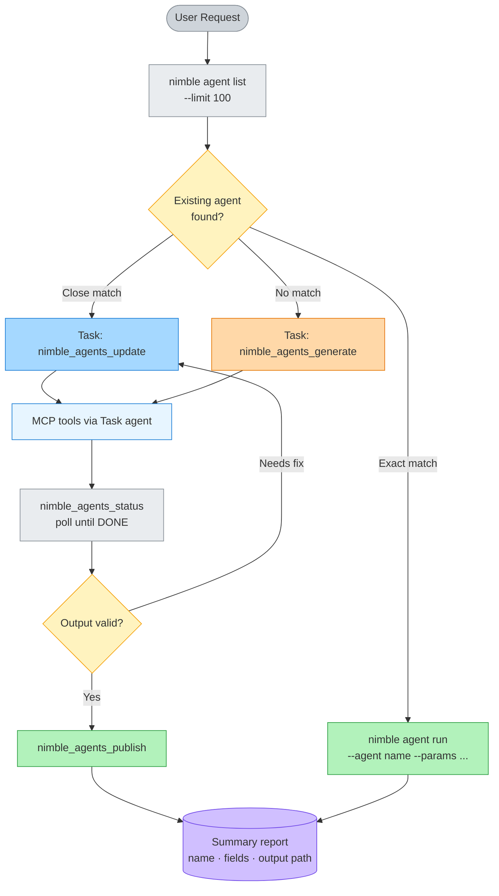

# nimble-agent-builder

[](https://opensource.org/licenses/MIT)

Find, generate, update, and run structured-data agents on the Nimble platform. Discover existing agents for 50+ sites, update them for new fields, or create custom ones from scratch — all via natural language.

## What it does

| Task                       | Example                                                |
| -------------------------- | ------------------------------------------------------ |
| Discover an existing agent | "Find an agent for Amazon product pages"               |
| Run an agent interactively | "Get data for ASIN B08N5WRWNW"                         |
| Update an agent            | "Add customer reviews field to the Amazon agent"       |
| Generate a new agent       | "Build an agent for Etsy product listings"             |
| Generate a batch script    | "Write a Python script to extract 500 Zillow listings" |

## Requirements

- **Nimble API key** — [online.nimbleway.com/signup](https://online.nimbleway.com/signup)
- **Nimble MCP server** connected to your AI tool

## Setup

### Claude Code

```bash
export NIMBLE_API_KEY="your_api_key"
claude mcp add --transport http nimble-mcp-server https://mcp.nimbleway.com/mcp \
  --header "Authorization: Bearer ${NIMBLE_API_KEY}"
```

### Cursor / VS Code (Copilot / Continue)

```json
{
  "nimble-mcp-server": {
    "command": "npx",
    "args": [
      "-y",
      "mcp-remote@latest",
      "https://mcp.nimbleway.com/mcp",
      "--header",
      "Authorization:Bearer YOUR_API_KEY"
    ]
  }
}
```

## How it works



> Interactive diagram: [nimble-agent-builder.excalidraw](nimble-agent-builder.excalidraw)

The skill follows a four-step flow:

1. **Route** — runs `nimble agent list --limit 100` (CLI) to find existing agents. Prefers update over generate.
2. **Run** — interactive execution via `nimble agent run` CLI (≤5 items) or script generation for bulk (>50 items).
3. **Build** — creates or updates agents on the Nimble platform via Task agents.
4. **Report** — summary table with agent used, source, records extracted, and output location.

**Key rules:**

- Always search for an existing agent before generating
- Update a close-match agent rather than creating from scratch
- Mutation tools (`generate`, `update`, `publish`) run inside Task agents — never in the foreground
- All Task agents use `run_in_background=False` to preserve MCP access

## Reference files

| File                                        | Purpose                                                    |
| ------------------------------------------- | ---------------------------------------------------------- |
| `references/agent-api-reference.md`         | MCP tool reference, input parameter mapping                |
| `references/sdk-patterns.md`                | Python SDK patterns, async endpoint, batch pipelines       |
| `references/rest-api-patterns.md`           | REST API for TypeScript, Node, curl                        |
| `references/batch-patterns.md`              | Multi-store comparison, normalization, codegen walkthrough |
| `references/generate-update-and-publish.md` | Full agent lifecycle: create → poll → validate → publish   |
| `references/error-recovery.md`              | Error handling, quota limits, fallback hierarchy           |
