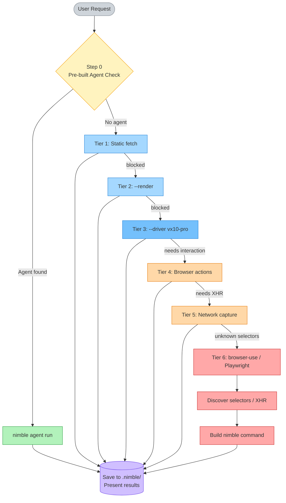

# nimble-web-expert

[](https://opensource.org/licenses/MIT)

Get live web data instantly — fetch any URL, scrape structured data, search the web, map sites, and capture XHR APIs. The only way Claude can access live websites.

## What it does

| Task                   | Example                                          |
| ---------------------- | ------------------------------------------------ |
| Fetch a webpage        | "What does this page say?" + URL                 |
| Scrape structured data | "Get all prices from this product listing"       |
| Web search             | "Find recent news about EU AI Act"               |
| Discover site URLs     | "Map all product pages on example.com"           |
| Capture XHR/API data   | "Get the JSON this page loads its listings from" |
| Run pre-built agents   | "Get data for Amazon ASIN B08N5WRWNW"            |
| Browser investigation  | "Find the CSS selectors on this site"            |

## Requirements

- **Nimble CLI** — installed and authenticated (`nimble --version` to verify)
- **Nimble API key** — [online.nimbleway.com/signup](https://online.nimbleway.com/signup)

## Setup

```bash
# Install the Nimble CLI
npm install -g @nimbleway/cli

# Authenticate
nimble login
```

### Optional: Nimble Docs MCP (recommended)

Gives Claude direct access to the full Nimble documentation — CLI flags, schemas, API reference.

```bash
claude mcp add --transport http nimble-docs https://docs.nimbleway.com/mcp
```

## How it works

The skill follows a tiered extraction strategy — escalating automatically until data is found:



> Interactive diagram: [nimble-web-expert.excalidraw](nimble-web-expert.excalidraw)

| Tier   | Method                               | When used                                                   |
| ------ | ------------------------------------ | ----------------------------------------------------------- |
| Step 0 | Pre-built agent check                | Always first — 50+ sites covered                            |
| 1      | Static fetch                         | Simple HTML pages                                           |
| 2      | Rendered fetch (`--render`)          | JavaScript-rendered pages                                   |
| 3      | Premium render (`--driver vx10-pro`) | Bot-protected sites                                         |
| 4      | Browser actions                      | Pages requiring clicks/scrolls                              |
| 5      | Network capture                      | XHR/API interception                                        |
| 6      | Browser investigation                | Unknown selectors — discover with browser-use or Playwright |

**Key rules:**

- Always checks for a pre-built agent before extracting (Amazon, Walmart, Yelp, LinkedIn, and 40+ more)
- One command → results → done. No looping or retrying
- Escalates render tiers silently — only asks when investigation tools are needed
- Never answers from training data — always fetches live

## Reference files

| File                                                 | Purpose                                                       |
| ---------------------------------------------------- | ------------------------------------------------------------- |
| `references/recipes.md`                              | Ready-to-run commands for 20+ popular sites                   |
| `references/error-handling.md`                       | Common errors and fixes                                       |
| `references/nimble-extract/SKILL.md`                 | Full `nimble extract` flag reference                          |
| `references/nimble-extract/parsing-schema.md`        | Parser schema and CSS selector patterns                       |
| `references/nimble-extract/browser-actions.md`       | Click, scroll, wait action sequences                          |
| `references/nimble-extract/browser-investigation.md` | Tier 6 — finding selectors/XHR with browser-use or Playwright |
| `references/nimble-extract/network-capture.md`       | XHR/API interception patterns                                 |
| `references/nimble-search/SKILL.md`                  | `nimble search` flag reference                                |
| `references/nimble-search/search-focus-modes.md`     | 8 focus modes (news, web, jobs, etc.)                         |
| `references/nimble-map/SKILL.md`                     | `nimble map` URL discovery reference                          |
| `references/nimble-crawl/SKILL.md`                   | `nimble crawl` bulk extraction reference                      |
| `references/nimble-agents/SKILL.md`                  | `nimble agent` CLI reference                                  |

## Works alongside nimble-agent-builder

| Skill                        | Best for                                                    |
| ---------------------------- | ----------------------------------------------------------- |
| **nimble-web-expert** (this) | Get data now — one-off fetches, real-time lookups           |
| **nimble-agent-builder**     | Build reusable agents — scheduled, at-scale, API-accessible |

Agents built by nimble-agent-builder appear in `nimble agent list` and are immediately usable here via `nimble agent run`.
